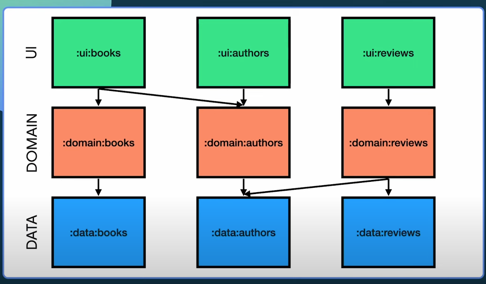
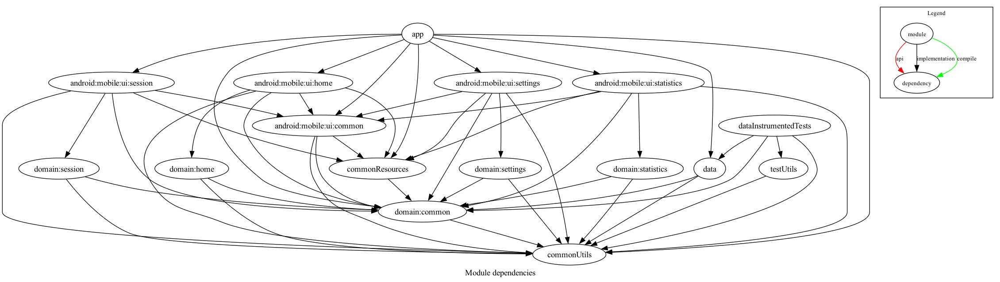

# SimpleHIIT

This is a simple HIIT Android App for Android TV and mobile devices.

* Sessions settings can be refined, like work and rest period duration, number of work period per cycle, and which exercise family to include in a session, or create and edit users. 
* On the home screen one can select which user(s) are joining a session, and how many cycle(s) the session should contain.
* The session consists of an alternance of rest and exercise periods, showing an exercise as a looping gif image. A summary of the exercises done is shown at the end of the session.
* A statistics screen allows to see (and delete) basic statistics for each user. 

## Caracteristics: 

* "Clean architecture"
* ~~single-module~~ multi-module app (see transition telling below)
* Dagger-hilt for DI
* pure kotlin
* coroutines and flows / stateflows
* Jacoco for test coverage report generation
* Compose for UI
* handle device form-factor variation (TV / mobile) in the same project

## This is a WIP: [see current TODO list](https://github.com/shining-cat/SimpleHIIT/blob/master/TODO.md)

## Thread choices

The current recommendation is to [inject dispatchers](https://developer.android.com/kotlin/coroutines/coroutines-best-practices#inject-dispatchers), so tests can then inject their own and manipulate them as needed.

### Presentation layer - Main thread

I have chosen to inject the _main_ dispatcher into the viewmodels, as they have UI-related responsibilities.
The viewmodels will still rely on the _viewModelScope_, since it has the advantage of being lifecycle-aware. They do specify the injected dispatcher as the one that scope should use .
This strategy is made possible by following the recommendation that [all suspend methods should be safe to call from the main thread](https://developer.android.com/kotlin/coroutines/coroutines-best-practices#main-safe)

### Data layer - IO thread

Following this rule, I chose to make the _Data_ layer (through its only entry point, the repository implementation) responsible for all usages of the _IO_ thread, injecting this dispatcher in _SimpleHiitRepositoryImpl_. This choice is dictated by the fact that the data layer is the one aware of any io operations, if any.
Thus all suspend methods in the _SimpleHiitRepository_ include a thread switch towards the IO one. 

### Domain layer - Default thread

Lastly, the _Domain_ layer, as the central point of the clean architecture, also exposes some suspend methods to the _Presentation_ layer. Some of those methods do include some computation work, while others simply call and handle _Data_ layer suspend methods. As the _Data_ layer is responsible for picking the adequate thread to use in its own suspend methods, I feel like the _Domain_ layer has nothing to do with the _IO_ thread. Thus, I will only inject the _Default_ dispatcher in this layer, to be used by suspend methods in the usecases. 

## Notes on UseCases

My usecases follow a common convention:
* They are named [action]+"UseCase"
* They expose a single public method named "execute", suspending or not, with various input parameters, as needed 

[While I like the idea of replacing the `execute` method by an override of the `invoke` operator](https://chrynan.codes/invoking-usecases-the-kotlin-way/), I found out that it has 2 main drawbacks:
1. First, and that is a big issue in my mind, overriding the `invoke` operator is mostly interesting because it allows one to shorten the call site code, by simply _invoking_ the usecase.
   Now that last point in my opinion comes with a steep decrease in discoverability, as **it will break the IDE's ability to find usages of the invoke method**, thus greatly hindering navigation around the code.
2. Removing the "Usecase" suffix makes the task of finding names harder, as the usecase is usually invoked from inside a viewmodel's method. Now this method could very well have the same name, and the "Usecase" suffix allows keeping the same name for both:
   UserManagementViewModel:createUser(user) can call createUserUseCase(user). If your usecase is also named CreateUser, troubles won't be long coming

These are the reasons why I'll keep using the "traditional" regarding usecases, as I value discoverability and clarity more than conciseness and clever tricks.

## Modularization

This project started as a single-module architecture, and I decided later to split it into modules.
Reading [this article](https://betterprogramming.pub/the-real-clean-architecture-in-android-modularization-e26940fd0a23) and [these updated recommendations from Google](https://developer.android.com/topic/modularization/patterns), I have decided to split the project into modules.
I'll aim for a matrix-like structure, where columns would be close to what features would be (here, Home, Settings, Session, Statistics) and rows would be close to the architectural layers (presentation, domain, and data)
This screenshot from the Google article's video shows the idea that got me started: 

Current state of the inter-modules relations, generated with [Savvas Dalkitsis' plugin](https://github.com/savvasdalkitsis/module-dependency-graph#module-dependency-graph)

### Process

I started by extracting the whole **_domain_** layer, as it is the one that all others depend on, and that will allow extracting the others without creating a circular dependency from them on the app module.
On the long term, I think the domain module will be split further, only retaining common domain-related objects, while all features-related code will be extracted to smaller feature-dedicated domain modules. 
**Note on creating new module from AS ide**: AS will add these two plugins to the main build.gradle.kts, and that will fail the build. simply remove them: `id("com.android.library") version
id("org.jetbrains.kotlin.android")`

The _**data**_ layer has been extracted as a single module, although it might be split further too. This is less certain though, as we only have little data management, and only two sources for it: Room and DataStore. The databases for users and sessions are joined, so splitting them appart to follow the features' separation would mean losing the benefit of this joint. 
**Note on Instrumented tests for the data layer**: while extracting the data layer from the app module, I lost the ability to run the instrumented tests. For some reason I wasn't able to understand, I never managed to get them working, when they still worked fine if placed back in the app module.
I always had build failures claiming I was missing a dependency on coroutines.test, which I had added.
This led me to an workaround, as I didn't want to keep those tests in the app module, inspired by [this article about dedicating modules to tests](https://proandroiddev.com/effective-testing-with-android-test-only-modules-3164ed9b20a0) and [this short mention in the Google's doc](https://developer.android.com/studio/test/advanced-test-setup#use-separate-test-modules-for-instrumented-tests).
This is the origin story of the test-module _dataInstrumentedTests_.  

### Extracting common gradle code

One can't anymore simply dump common gradle code in a shared file when using DSL as one did with Groovy.
It can still be done though. I found [this article detailing both the issue and solutions](https://proandroiddev.com/sharing-build-logic-with-kotlin-dsl-203274f73013), and applied the _Precompiled script plugins_ solution.
1. applied the `kotlin-dsl-precompiled-script-plugins` to `buildSrc/build.gradle.kts`
2. extracted the common gradle code to `libraries_gradle_config.gradle.kts`
3. applied the precompiled script generated by Gradle to the targeted modules' plugins block: `id("libraries_gradle_config")`

## Credits

All exercise pictures were made with the help of the awesome [PoseMyArt](https://app.posemy.art/) free web app

### External libraries / plugins

* [Ben Mannes' Gradle version plugin](https://github.com/ben-manes/gradle-versions-plugin#gradle-versions-plugin)
* [GMazzo's jacoco test coverage aggregation gradle plugin](https://github.com/gmazzo/gradle-android-test-aggregation-plugin#gradle-android-test-aggregation-plugin)
* [Savvas Dalkitsis' Inter-modules dependencies graph generator plugin](https://github.com/savvasdalkitsis/module-dependency-graph#module-dependency-graph)
* [Mockk library](https://mockk.io/)
* [Coil image loading library](https://coil-kt.github.io/coil/)

### References

* [The “Real” Modularization in Android](https://betterprogramming.pub/the-real-clean-architecture-in-android-modularization-e26940fd0a23) by Better Programming
  Denis Brandi
* [Effective testing with Android Test Only Modules](https://proandroiddev.com/effective-testing-with-android-test-only-modules-3164ed9b20a0) by Shubham Garg
* [Sharing build logic with Kotlin DSL](https://proandroiddev.com/sharing-build-logic-with-kotlin-dsl-203274f73013) by Chirag Kunder
* 