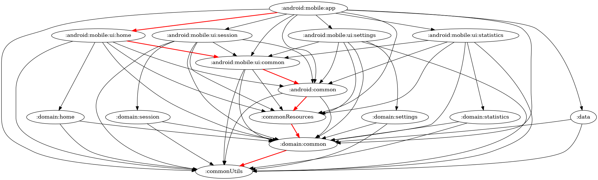

![[https://github.com/shining-cat/SimpleHIIT/actions/workflows/android-verifications.yml]](https://github.com/shining-cat/SimpleHIIT/actions/workflows/android-verifications.yml/badge.svg)

# SimpleHIIT

This is a simple HIIT Android App for Android TV and mobile devices.

* Sessions settings can be refined, like work and rest period duration, number of work period per
  cycle, and which exercise family to include in a session, or create and edit users.
* On the home screen one can select which user(s) are joining a session, and how many cycle(s) the
  session should contain.
* The session consists of an alternance of rest and exercise periods, showing an exercise as a
  looping gif image. A summary of the exercises done is shown at the end of the session.
* A statistics screen allows to see (and delete) basic statistics for each user.

## Caracteristics:

* MVVM - Clean architecture
* multi-module
* Dagger-hilt for DI
* pure kotlin
* coroutines and flows / stateflows
* Kover for test coverage report generation
* Full-Compose for UI
* handle device form-factor variation (TV / mobile) in the same project

## This is a WIP: [see current TODO list](https://github.com/shining-cat/SimpleHIIT/blob/master/TODO.md)

## Threading Strategy

This project uses **dispatcher injection** for clean thread management across architecture layers:
- **Presentation** (ViewModels): Main thread
- **Domain** (Use Cases): Default thread
- **Data** (Repository): IO thread

All suspend methods are main-safe, enabling testability through `TestDispatcher` injection.

**For complete details** on threading choices and rationale, see [docs/THREADING.md](docs/THREADING.md).

## Notes on UseCases

Usecases follow a common convention:

* They are named [action]+"UseCase"
* They expose a single public method named "execute", suspending or not, with various input
  parameters, as needed 

[While I like the idea of replacing the `execute` method by an override of the
`invoke` operator](https://chrynan.codes/invoking-usecases-the-kotlin-way/), I found out that it has
2 main drawbacks:

1. First, and that is a big issue in my mind, overriding the `invoke` operator is mostly interesting
   because it allows one to shorten the call site code, by simply _invoking_ the usecase.
   Now that last point in my opinion comes with a steep decrease in discoverability, as **it will
   break the IDE's ability to find usages of the invoke method**, thus greatly hindering navigation
   around the code.
2. Removing the "Usecase" suffix makes the task of finding names harder, as the usecase is usually
   invoked from inside a viewmodel's method. Now this method could very well have the same name, and
   the "Usecase" suffix allows keeping the same name for both:
   UserManagementViewModel:createUser(user) can call createUserUseCase(user). If your usecase is
   also named CreateUser, troubles won't be long coming

These are the reasons why I'll keep using the "traditional" structure for usecases, as I value
discoverability and clarity more than conciseness.

## Notes on ViewModels

ViewModels are provided with a dedicated `Interactor`, which is a simple convenience wrapper around
all the usecases the viewmodel needs.
This is mostly to reduce the list of constructor parameters in the ViewModel, and simplify the
addition of any new usecase to it. 
Since the group of usecases needed might vary between platforms and their dedicated presentation
layer, the `interactor` is part of the presentation layer too.

## Modularization

This project follows a **matrix-like modularization** structure with strict clean architecture principles:
- **Features** (columns): Home, Settings, Session, Statistics
- **Layers** (rows): Presentation (UI), Domain, Data
- **Platforms**: Mobile and TV with shared foundation modules

The dependency graph shows the current validated module structure. It's automatically updated by CI on every PR after successful dependency validation. Dependencies flow **top-to-bottom** only, with lateral dependencies restricted to `common` modules.

**For complete details** on module architecture, dependency rules, and enforcement, see [docs/MODULE_DEPENDENCIES.md](docs/MODULE_DEPENDENCIES.md).

**Note on creating new modules in Android Studio**: AS will add these plugins to the main build.gradle.kts - remove them as they'll fail the build:
* `id("com.android.library") version ...`
* `id("org.jetbrains.kotlin.android") version ...`

## Credits

All exercise pictures were made with the help of the awesome [PoseMyArt](https://app.posemy.art/)
free web app

### External libraries / plugins

* [Ben Mannes' Gradle version plugin](https://github.com/ben-manes/gradle-versions-plugin#gradle-versions-plugin)
* [Kover - Kotlin code coverage by JetBrains](https://github.com/Kotlin/kotlinx-kover)
* [Modules Graph Assert - Dependency validation and visualization](https://github.com/jraska/modules-graph-assert)
* [Mockk library](https://mockk.io/)
* [Glide Compose image loading library](https://github.com/bumptech/glide)
* [Ktlint Gradle by Jonathan Leitschuh](https://github.com/JLLeitschuh/ktlint-gradle)

### References

* [The “Real” Modularization in Android](https://betterprogramming.pub/the-real-clean-architecture-in-android-modularization-e26940fd0a23)
  by Better Programming
  Denis Brandi
* [Effective testing with Android Test Only Modules](https://proandroiddev.com/effective-testing-with-android-test-only-modules-3164ed9b20a0)
  by Shubham Garg
* [Sharing build logic with Kotlin DSL](https://proandroiddev.com/sharing-build-logic-with-kotlin-dsl-203274f73013)
  by Chirag Kunder

### Gradle Tasks

Common tasks:
- **Validate dependencies**: `./gradlew assertModuleGraph --no-configure-on-demand`
- **Check code style**: `./gradlew ktlintCheck`
- **Run tests**: `./gradlew testDebugUnitTest`
- **Generate coverage**: `./gradlew testDebugUnitTest koverHtmlReport`
- **Check for updates**: `./gradlew dependencyUpdates`

**For complete task reference** including visualization, troubleshooting, and task combinations, see [docs/GRADLE_TASKS.md](docs/GRADLE_TASKS.md).
