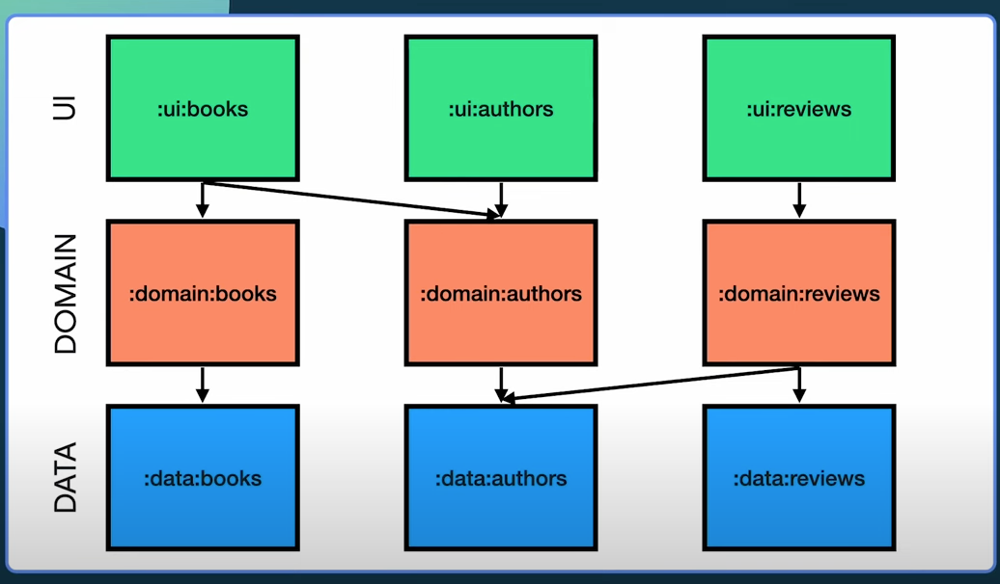
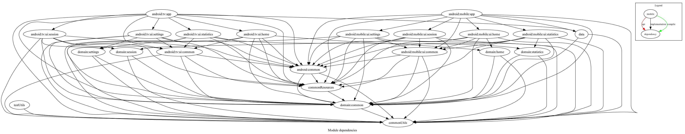

# Module Dependency Enforcement

This project uses the [modules-graph-assert](https://github.com/jraska/modules-graph-assert) Gradle plugin to enforce and validate inter-module dependencies.

## Modularization Strategy

This project started as a single-module architecture and was later split into modules following clean architecture principles.

Based on [this article](https://betterprogramming.pub/the-real-clean-architecture-in-android-modularization-e26940fd0a23)
and [Google's modularization recommendations](https://developer.android.com/topic/modularization/patterns),
the project uses a **matrix-like structure** where:
- **Columns** represent features (Home, Settings, Session, Statistics)
- **Rows** represent architectural layers (Presentation, Domain, Data)



### Current Module Structure



The dependency graph is **automatically updated** by CI when changes are merged to master. A separate workflow validates dependencies on every PR to ensure module rules are enforced before merging. This ensures the graph always reflects the current, validated module structure from the mobile app's perspective.

### Layer Responsibilities

**Data Layer** (`:data`)
- Extracted as a single module
- Manages Room database and DataStore
- Could be split further, but databases for users and sessions are joined to maintain referential integrity

**Domain Layer** (`:domain:*`)
- Feature-specific modules (`:domain:home`, `:domain:session`, `:domain:settings`, `:domain:statistics`)
- Shared common module (`:domain:common`)
- Pure business logic with no framework dependencies

**Presentation Layer** (`:android:mobile:ui:*`, `:android:tv:ui:*`)
- Platform-specific (Mobile/TV)
- Feature-specific UI modules under each platform
- Shared common UI modules per platform

**Common Modules**
- `:commonUtils` - Foundation utilities, no dependencies
- `:commonResources` - Shared resources (strings, drawables, themes)
- `:android:common` - Platform common components

### Special Design Pattern: Type-Safe Resources

**Why `commonResources` → `domain:common`?**

The `commonResources` module depends on `domain:common` to enable **type-safe resource management**. This pattern:

1. **Mapper classes connect domain to resources**
   - Domain enums/sealed classes represent pure business concepts (e.g., `Exercise`)
   - `commonResources` contains mapper classes (e.g., `ExerciseDisplayNameMapper`)
   - Mappers translate domain objects to resource IDs: `mapper.map(exercise) → R.string.exercise_name`

2. **Benefits:**
   - **Domain stays pure**: No Android resource references in business logic
   - **Compile-time safety**: Exhaustive `when` expressions ensure all domain cases handled
   - **Centralized mapping**: All domain-to-resource logic in one place
   - **Type-safe**: Can't request resources for non-existent domain objects
   - **Testable**: Mappers are simple, pure functions easy to unit test
   - **Refactoring-friendly**: IDE renames domain types → mapper updates automatically

3. **No circular dependency:**
   - Resources depend on domain types (to map them)
   - Domain layer never depends on resources (pure business logic)
   - UI injects mappers and uses them: `getString(exerciseMapper.map(exercise))`

**Example:**
```kotlin
// Domain (pure)
sealed class Exercise { object Lunges : Exercise() }

// commonResources (mapper)
class ExerciseDisplayNameMapper {
    fun map(exercise: Exercise): Int = when (exercise) {
        Exercise.Lunges -> R.string.exercise_lunges
    }
}

// UI (uses mapper)
val name = getString(exerciseMapper.map(exercise))
```

This creates a clean dependency chain: `UI → commonResources (mappers) → domain:common (types)` where mappers act as a type-safe bridge between pure domain concepts and their visual representation.

## Dependency Rules

This project enforces **strict clean architecture** with automated validation.

### Architecture Layers

```
┌─────────────────┐
│   App Modules   │  ← Top (can depend on everything)
├─────────────────┤
│   UI Modules    │  ← Presentation layer
├─────────────────┤
│  Domain Layer   │  ← Business logic
├─────────────────┤
│   Data Layer    │  ← Data sources
├─────────────────┤
│ Common Modules  │  ← Foundation
└─────────────────┘
```

**Rule of thumb:** Dependencies flow **top-to-bottom** only. Lateral dependencies (within same layer) are restricted to `common` modules.

### Rule Configuration

Dependency rules are defined in the `moduleGraphAssert` block in:
- [`android/mobile/app/build.gradle.kts`](../android/mobile/app/build.gradle.kts) (mobile-specific rules)
- [`android/tv/app/build.gradle.kts`](../android/tv/app/build.gradle.kts) (TV-specific rules)

Each configuration specifies:
- `allowed`: Array of permitted dependency patterns (using regex)
- `restricted`: Array of explicitly forbidden dependencies
- `maxHeight`: Maximum tree height (currently 7 levels)

### Key Principles

- **Domain layer** remains pure: cannot depend on data, UI, or app modules
- **Data layer** doesn't know about presentation: cannot depend on UI or app modules
- **No upward dependencies**: no module can depend on app modules
- **Foundation isolation**: `commonUtils` and `testUtils` cannot depend on anything
- **Lateral restriction**: features can only share via `common` modules

### Maximum Tree Height

The dependency tree is limited to a maximum height of **7 levels**. Current longest path:
```
App → UI Feature → UI Common → Android Common → Common Resources → Domain Common → Common Utils
```

## Running Checks

### Locally

```bash
# Validate all module dependencies
./gradlew assertModuleGraph --no-configure-on-demand

# Generate dependency graph visualization
./gradlew :android:mobile:app:generateModulesGraphvizText -Pmodules.graph.of.module=:android:mobile:app --no-configure-on-demand

# View module statistics
./gradlew generateModulesGraphStatistics --no-configure-on-demand
```

The `assertModuleGraph` task includes three sub-tasks:
- `assertAllowedModuleDependencies` - Validates allowed patterns
- `assertRestrictions` - Validates forbidden dependencies
- `assertMaxHeight` - Validates tree height

### In CI/CD

The project uses two separate GitHub Actions workflows for module dependency management:

**Verification Workflow** (runs on pull requests to `master` or `develop`):
1. Validates dependencies (`assertModuleGraph`)
2. If any rule is violated, the build fails and prevents merging

**Update Dependency Graph Workflow** (runs on merges to `master`):
1. Generates the dependency graph visualization
2. Commits the updated graph image to the repository
3. Uploads graph as artifact (90-day retention)
4. Can also be triggered manually from GitHub Actions web interface

This separation ensures that PRs are validated quickly without generating artifacts, while the dependency graph is updated automatically when changes land on master.

## Visualizing the Module Graph

### Generate Graphviz Text

```bash
./gradlew generateModulesGraphvizText
```

Outputs Graphviz DOT format that can be visualized using:
- [Graphviz Online](https://dreampuf.github.io/GraphvizOnline/)
- [WebGraphviz](http://www.webgraphviz.com/)
- Local Graphviz: `dot -Tpng output.gv -o graph.png`

Save to file:
```bash
./gradlew generateModulesGraphvizText -Pmodules.graph.output.gv=module_graph
```

Generate for specific module:
```bash
./gradlew generateModulesGraphvizText -Pmodules.graph.of.module=:android:mobile:app
```

### Generate Module Statistics

```bash
./gradlew generateModulesGraphStatistics
```

Prints useful metrics:
- Total modules count
- Total edges (dependencies)
- Tree height
- Longest dependency path

## Modifying the Rules

To modify dependency rules:

1. Edit the `moduleGraphAssert` block in the relevant build file:
   - `android/mobile/app/build.gradle.kts`
   - `android/tv/app/build.gradle.kts`

2. Run checks locally:
   ```bash
   ./gradlew assertModuleGraph --no-configure-on-demand
   ```

3. Commit changes and create PR - CI will validate the new rules

## Troubleshooting

### Build Fails with "Type mismatch" Error

The plugin requires `arrayOf()` not `listOf()`:

**Correct:**
```kotlin
allowed = arrayOf("pattern1", "pattern2")
```

**Incorrect:**
```kotlin
allowed = listOf("pattern1", "pattern2")
```

### Build Fails with "Maximum height exceeded"

Your dependency tree is too deep. Either:
1. Refactor to reduce nesting (recommended)
2. Increase `maxHeight` value (only if justified)

### Build Fails with "Configuration on demand" Warning

Always use the `--no-configure-on-demand` flag:

```bash
./gradlew assertModuleGraph --no-configure-on-demand
```

### Module Not Visible to Plugin

If modules are missing, it may be due to Gradle's "Configuration on Demand" feature. Use `--no-configure-on-demand`.

## References

- [Plugin Documentation](https://github.com/jraska/modules-graph-assert)
- [Medium Article: Module Rules](https://proandroiddev.com/module-rules-protect-your-build-time-and-architecture-d1194c7cc6bc)
- [Talk: Modularization - Flatten Your Graph](https://www.droidcon.com/2022/11/15/modularization-flatten-your-graph-and-get-the-real-benefits/)
- [The "Real" Modularization in Android](https://betterprogramming.pub/the-real-clean-architecture-in-android-modularization-e26940fd0a23)
- [Google's Modularization Patterns](https://developer.android.com/topic/modularization/patterns)
